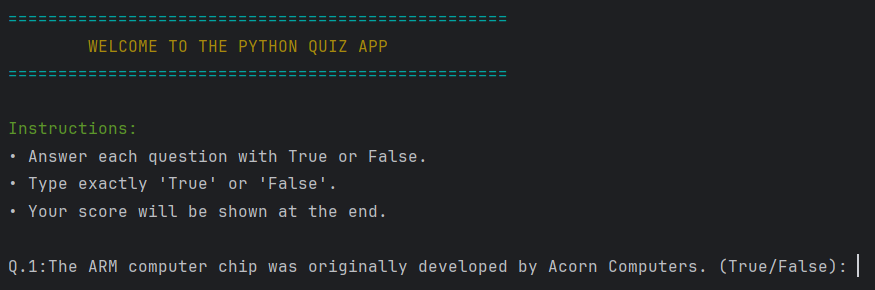

# Python Quiz App

A simple command-line quiz application built in Python using Object-Oriented Programming.

## Features

- Multiple choice quiz
- Tracks score
- Object-Oriented Design
- Question bank
- Displays final score

## Technologies Used

- Python
- OOP

## Project Structure

```
Python-Quiz-App/
│
├── main.py
├── question_model.py
├── quiz_brain.py
├── data.py
└── README.md
```

## How to Run

```bash
python main.py
```
## Screenshot


